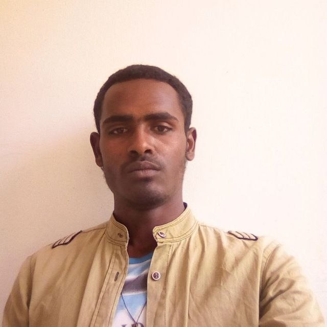

# Aytenew Ayele

## Currently Learning

- Python Programming
- HTML5, - CSS3- JavaScript
- SQL & PostgreSQL- MongoDB
- REST APIs
- Full-Stack Web Development

## My Goals

- Strengthen my programming fundamentals.
- Build responsive and user-friendly web applications.
- Learn backend development and database design.
- Develop real-world full-stack projects.
- Contribute to open-source projects.
- Build a strong professional software development portfolio.
